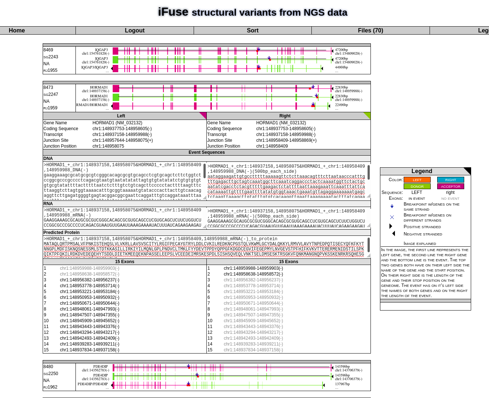

# iFUSE: Integrated Fusion Gene Explorer

This repository contains the code described in [Hiltemann et al. 2013 ](https://doi.org/10.1093/bioinformatics/btt252)

The associated Docker images is hosted on Quay.io [here](https://quay.io/repository/erasmusmc_bioinformatics/ifuse)

# Prerequisites

Install Docker according to the [official installation instructions](https://docs.docker.com/get-docker/)

# Running iFUSE

First, get the Docker image from Quay.io:

```bash
$ docker pull quay.io/erasmusmc_bioinformatics/ifuse
```

Next, run the Docker container

```bash
$ docker run -p 8080:80 erasmusmc_bioinformatics/ifuse
```

Next, open your browser, and navigate to `http://localhost:8080`

You should now see the iFUSE home page.

# How to use iFUSE

For full documentation, please see the [iFUSE manual](ifuse_manual.pdf) included in this repository.

1. Create an account by clicking on "Register"
2. Upload a file containing SV breakpoints
   - Example files are provided in this repo in the `test-data` folder
3. Provide metadata
   - File type (`complete genomics` or `fusionmap`)
   - Reference genome (`hg18` or `hg19`)
4. Click `Upload`
5. Wait
   - iFUSE will now analyse your dataset, this may take a few minutes if your data is large
6. Explore your fusion gene candidates
   - You will be brought to the results page with visualisations of all candidate fusion events
   - Right-click an image to get more information (e.g. details view)
   - Filtering and sorting is also possible via the right-click menu
   - The details view includes predicted sequence of the fusion event:
     

# Building locally

Should you be interested in modifying iFUSE, you can build the Docker image locally as follows:

```bash
$ docker build -t ifuse .
```

And then run it:

```bash
$ docker run ifuse -p 8080:80
```

And navigate to `http://localhost:8080` to view iFUSE.
